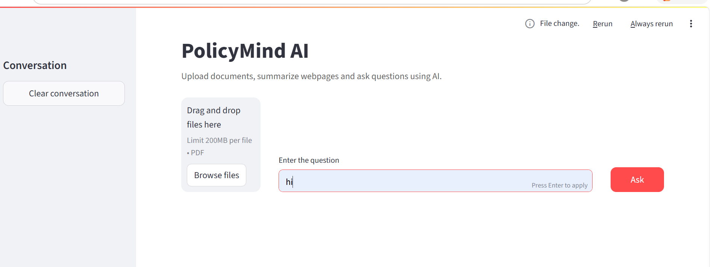
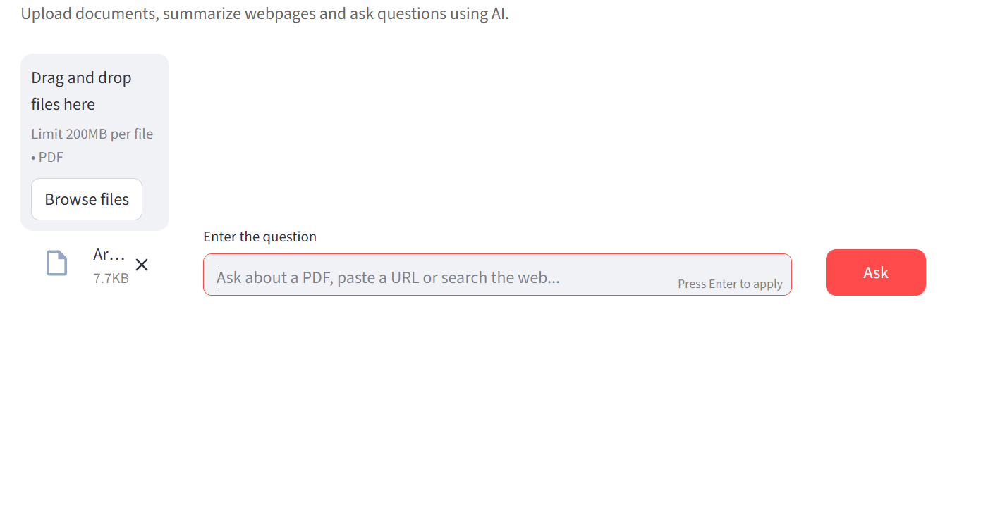
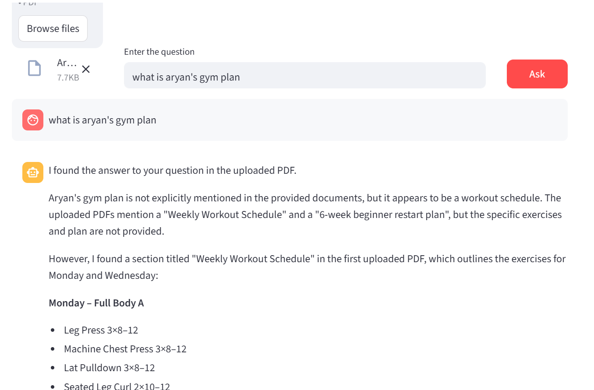

# Insurance Policy Intelligence System

AI-powered question answering using Retrieval-Augmented Generation (RAG) with contextual document retrieval
# Features

- Upload and analyze one or more PDF documents
- AI-powered question answering using Retrieval-Augmented Generation (RAG)
- Semantic search over insurance policy documents
- Internet search integration for public information
- Summarize YouTube videos and webpages
- AI Agent that automatically selects the appropriate tool
- AWS Bedrock integration for LLMs and embeddings
- Interactive Streamlit web interface

# Tech Stack

- **Programming Language:** Python
- **LLM:** Amazon Nova Lite (AWS Bedrock)
- **Embeddings:** Amazon Titan Embeddings v2
- **Framework:** LangChain
- **Vector Database:** Astra DB
- **Frontend:** Streamlit
- **PDF Processing:** PyPDFLoader
- **Text Splitting:** RecursiveCharacterTextSplitter
- **Internet Search:** DuckDuckGo Search
- **Deployment Ready:** AWS BedrocK

  ## 🏗️ System Architecture

```text
                    +--------------------+
                    |       User         |
                    +--------------------+
                              |
                              v
                    +--------------------+
                    |   Streamlit UI     |
                    +--------------------+
                              |
                +-------------+-------------+
                |                           |
                v                           v
        Uploaded PDF                 User Question
                |                           |
                +-------------+-------------+
                              |
                              v
                    +--------------------+
                    |   LangChain Agent   |
                    +--------------------+
                    |        |           |
          PDF Tool  |  Web Search | URL Tool
                    |        |           |
                    +--------+-----------+
                              |
                              v
                     Amazon Bedrock LLM
                              |
                              v
                      Final AI Response
```

# Project Structure

```text
insurance-policy-intelligence-system/
│
├── app.py                 # Main Streamlit application
├── model.py               # AWS Bedrock model wrapper
├── requirements.txt       # Python dependencies
├── README.md              # Project documentation
│
├── screenshots/           # Application screenshots
│
└── .env.example           # Environment variable template

## ⚙️ Installation

### 1. Clone the repository

```bash
git clone https://github.com/YOUR_USERNAME/insurance-policy-intelligence-system.git
```

### 2. Navigate to the project

```bash
cd insurance-policy-intelligence-system
```

### 3. Install dependencies

```bash
pip install -r requirements.txt
```
### 4. Configure Environment Variables

Create a `.env` file in the project root and add your own credentials.

```text
API_ENDPOINT=YOUR_ASTRA_DB_ENDPOINT
API_TOKEN=YOUR_ASTRA_DB_TOKEN

AWS_ACCESS_KEY_ID=YOUR_AWS_ACCESS_KEY
AWS_SECRET_ACCESS_KEY=YOUR_AWS_SECRET_KEY
AWS_REGION=us-east-1
```

Replace the placeholder values with your own Astra DB and AWS credentials before running the application.

### 5. Run the application

```bash
streamlit run app.py
```

# Usage

1. Launch the Streamlit application.
2. Upload one or more insurance policy PDF documents.
3. Enter your question in the input field.
4. The AI agent automatically determines whether to:
   - Search the uploaded PDF documents
   - Search the web for public information
   - Summarize a webpage or YouTube video
5. Review the AI-generated response directly in the application.

## Future Improvements

- Add conversation memory for follow-up questions.
- Support additional document formats (DOCX, TXT, HTML).
- Improve citation-based responses with page references.
- Deploy the application on AWS or Streamlit Community Cloud.
- Integrate authentication for secure multi-user access.
- Enhance retrieval accuracy using hybrid search techniques.

## Author

**Aryan Shetty**

- LinkedIn:https://linkedin.com/in/YOUR_LINKEDIN](https://www.linkedin.com/in/aryan-shetty-247746170
- GitHub: https://github.com/aryan1775

## 📸 Application Preview

### Home Screen



---

### Upload PDF



---

### AI Response


